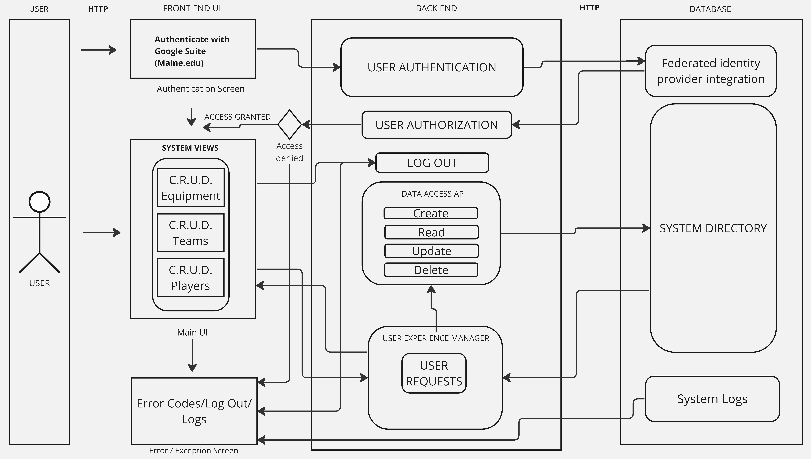

### About

**This is a capstone project for the University of Maine Athletics Department, in partial fulfillment of the Computer Science BS degree for the University of Maine. The goal of this project is to build a solution for managing and tracking sports equipment and apparel. The key stakeholders for our project are Jude Killy, Nick Fox, and Kevin Ritz. Jude Killy submitted the project on behalf of the athletic department to combat the issue of an inefficient inventory management process. Currently, Nick Fox and Kevin Ritz are tasked with managing inventory orders and distribution of items to players and teams. The inventory is currently only documented on a spreadsheet. The project group aims to develop a solution that can increase the efficiency of entering data items, storing inventory data, and tracking the distribution to athletes and teams.**

Our system will replace the customer's previous solutions for managing their equipment. The customer previously used [Front Rush](https://www.frontrush.com/web/) and currently uses a combination of spreadsheets and word of mouth to track inventory. Our product will allow the customer to organize their inventory by associating equipment with teams and players. The system will be designed with simplicity in mind so that they do not need experienced developers to maintain their product following the delivery date. 

### System Architecture

Our system is broken down into three core components: the front-end, the back-end, and the database. The front end is the portion of the system that the user will see and interact with through their browser. There are three general web pages that the user will be able to see: the login page, the main user interface, and the errors and exceptions page. The user will be immediately prompted to log in on arrival to the website. The system will leverage federated identity provider integration to allow the user to utilize their University of Maine login credentials to access the system like they would with any other University of Maine service. After the authentication and authorization process, the user attains access to the rest of the user interface system. From the main UI, the user will be able to perform actions such as creating, reading, updating, and deleting items from the database. The final interface is shown when the user logs out or reaches an error.  The back-end subsystem will process user requests on the web page and handle API calls to the database. The database will be a cloud-hosted solution and will securely store all of our system data as well as manage our user authentication. Alongside storing inventory and profile data, the database will also store system logs. 

Currently, to streamline development of the system, all components are run in Docker containers. We utilize docker-compose to quickly build and destory our entire system. Our front-end is built with React and CSS, our API is built using Node.js and express, and we use MySQL as our database.

### [View on GitHub](https://github.com/gsb02/IMSG_Capstone)

