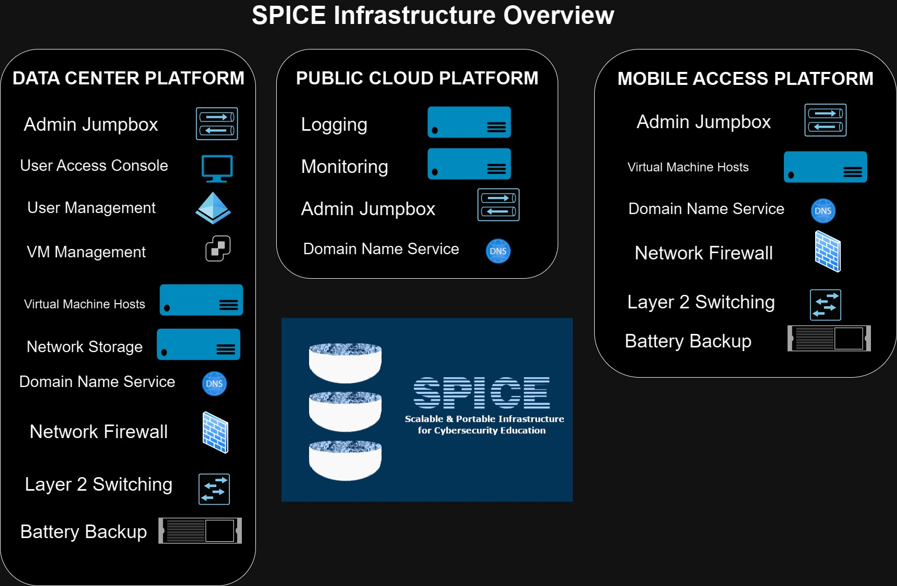
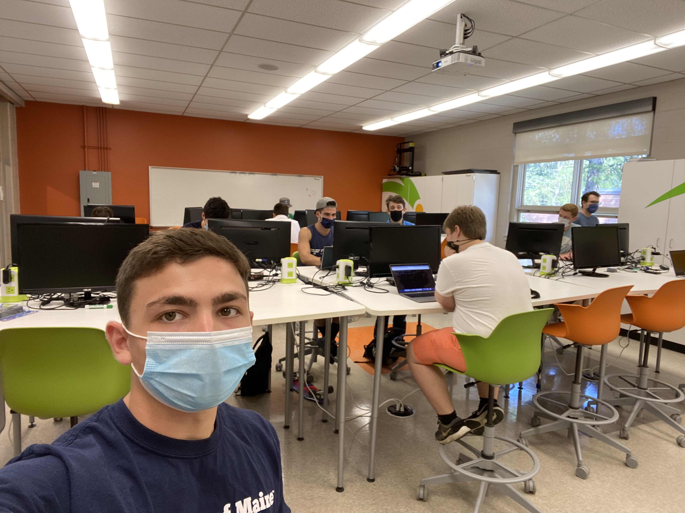

# SPICE Lab
**Link(s):** [https://github.com/UMCST/SPICE-user-info/wiki](https://github.com/UMCST/SPICE-user-info/wiki), [https://ece.umaine.edu/home/spice/](https://ece.umaine.edu/home/spice/)

### About 

The Scalable & Portable Infrastructure for Cybersecurity Education (SPICE) Lab, is remotely accessible infrastructure that leverages public cloud, data center, and portable computing resources. It was developed to support a variety of cybersecurity education activities.

The SPICE project was initiated during June of 2020, with supervision from UMaine’s Cybersecurity Education Committee(UM CSEC), and contribution from several student research assistants. Since initiation, the project has gone through several phases of development, and is currently in the fifth phase “Phase V” which is currently focused on documentation on the state of the infrastructure and technologies in use, and on improving efficiency using automation.

SPICE resources are leveraged by the [UMaine Cybersecurity Team](https://umcst.maine.edu/) in order to conduct cybersecurity lab tutorials and competition preparation activities. During the fourth phase of SPICE development, I led an agile team from May 2021 - May 2022. I led weekly sprint meetings where we created and delegated tasks, troubleshot problems, and reviewed progress. In my developmental role, I worked on patching and maintenance, and automation for cloud hosted cybersecurity labs. 

My work with the SPICE Lab gave me valuable experience in leadership and infrastructure development. I gained familiarity with VMware products, AWS, Terraform, Ansible, Docker, physical server and computer maintenance, and hybrid cloud infrastructure.  

  
   
    

**Overview of SPICE infrastructure**

 
  
   
 
 
  

**Leading the Network Recon Lab in 2021**
This partiuclar lab was hosted for remote and in-person participants. The Network Recon lab introuduces participants to Nmap, Wireshark, ports and running services, and basic Linux system administration. 

 
### Current Projects
I'm not currently working on any projects with the SPICE Lab, but I occasionaly help support UMCST-led cybersecurity practice competitions that leverage SPICE resources. 